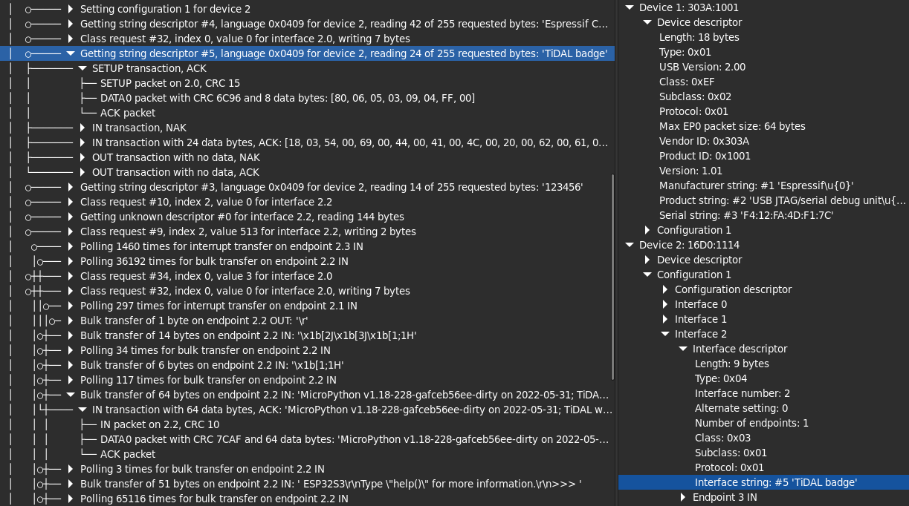

# Packetry

A fast, intuitive USB 2.0 protocol analysis application for use with [Cynthion](https://greatscottgadgets.com/cynthion/).

## Documentation

Read the latest [Packetry Documentation](https://packetry.readthedocs.io/).

## Development

Packetry is written in [Rust](https://rust-lang.org/), with its GUI using [GTK 4](https://gtk.org) via the [gtk-rs](https://gtk-rs.org/) bindings.

To build it, you need a working Rust development environment. The minimum supported Rust version is 1.75.

You must also have the GTK 4 headers installed and discoverable via `pkg-config`, as this is required for Rust to build the gtk-rs crates.

### Building and running

To build, run `cargo build` after installing the necessary prerequisites (see below). Run with `cargo run`.

If you pass a capture filename as an argument, Packetry will attempt to load it. The current supported file format is a `.pcap` file with the `LINKTYPE_USB_2_0` link layer header type.

Note: Do not build with `--all-features`. All the optional features currently in the package are for debug/test purposes only, and will prevent or degrade normal use of the application if enabled. See `Cargo.toml` for details.

### Installing prerequisites

#### Linux

Install the Rust build tools, other essential build tools, and GTK 4 headers.

On Debian based systems it may be sufficient to use the command:

`apt install rustc cargo build-essential libgtk-4-dev`

For Fedora systems:

`yum install rust cargo make gcc gcc-c++ gtk4-devel pango-devel`

For other distributions, a similar set of packages should be required.

Note that Packetry requires a minimum Rust version of 1.75. If your distribution's packages are older than this, use [rustup](https://rustup.rs/) to get the latest Rust toolchain and manage your Rust installation.

#### macOS

Install Rust with [rustup](https://rustup.rs/), and install [Homebrew](https://brew.sh/).

Install GTK 4 with `brew install gtk4`.

#### Windows

Follow the installation instructions from [GUI development with Rust and GTK 4](https://gtk-rs.org/gtk4-rs/stable/latest/book/installation_windows.html).

You can use either the MSVC or GNU toolchains.
