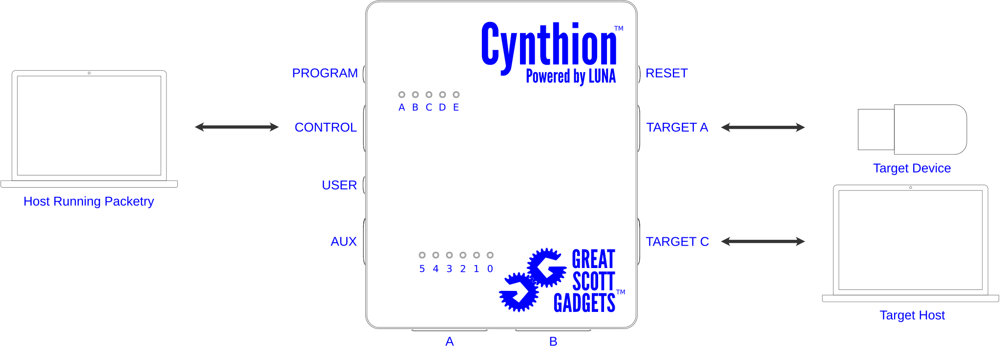

=============================
Getting Started with Packetry
=============================

Follow these steps to start analyzing live USB traffic with Packetry and Cynthion. If you want to use Packetry only to view existing capture files, you can skip the Cynthion steps.

Install Cynthion
----------------

Before installing Packetry, follow the instructions to `install Cynthion host software <https://cynthion.readthedocs.io/en/latest/getting_started.html>`__ and then ensure that your Cynthion is up to date by running:

.. code::

   cynthion update

Install Packetry
----------------

.. tab:: Linux

    .. tab:: Pre-built

        Download ``packetry-x86_64.AppImage`` from the `latest release <https://github.com/greatscottgadgets/packetry/releases/latest>`__. Follow the `AppImage Quickstart instructions <https://docs.appimage.org/introduction/quickstart.html>`__ to make the file executable.

    .. tab:: From source code

        **Install Prerequisites**

        Install the Rust build tools, other essential build tools, and GTK 4 headers:

        .. tab:: Debian/Ubuntu

            .. code::

                apt install rustc cargo build-essential libgtk-4-dev git

        .. tab:: Fedora

            .. code::

                yum install rust cargo make gcc gcc-c++ gtk4-devel pango-devel git

        Note that Packetry requires a minimum Rust version of 1.74. If your distribution's packages are older than this, use `rustup <https://rustup.rs/>`__ to get the latest Rust toolchain and manage your Rust installation.

        **Download Packetry Source Code**

        Clone the Packetry repository:

        .. code::

            git clone https://github.com/greatscottgadgets/packetry.git

        **Build and Install Packetry**

        .. code::

            cd packetry
            cargo build --release
            sudo cp target/release/packetry /usr/local/bin

        Hint: You can copy the ``packetry`` executable to any directory in your ``PATH`` instead of ``/usr/local/bin``. If you've used ``rustup`` and have ``~/.cargo/bin`` in your ``PATH``, ``~/.cargo/bin`` is a great choice!

        Note: Do not build with ``--all-features``. All the optional features currently in the package are for debug/test purposes only, and will prevent or degrade normal use of the application if enabled. See ``Cargo.toml`` for details.

.. tab:: macOS

    .. tab:: Pre-built

        Use `Homebrew <https://brew.sh/>`__ to install Packetry:

        .. code::

            brew install packetry

    .. tab:: From source code

        **Install Prerequisites**

        Use `rustup <https://rustup.rs/>`__ to install the latest Rust toolchain and manage your Rust installation.

        Use `Homebrew <https://brew.sh/>`__ to install GTK 4:

        .. code::

            brew install gtk4

        **Download Packetry Source Code**

        Clone the Packetry repository:

        .. code::

            git clone https://github.com/greatscottgadgets/packetry.git

        **Build and Install Packetry**

        .. code::

            cd packetry
            cargo build --release
            cp target/release/packetry ~/.cargo/bin

        Hint: You can copy the ``packetry`` executable to any directory in your ``PATH`` instead of ``~/.cargo/bin``. If you've used ``rustup``, ``~/.cargo/bin`` should be in your ``PATH``. Otherwise ``/usr/local/bin`` is a great choice!

        Note: Do not build with ``--all-features``. All the optional features currently in the package are for debug/test purposes only, and will prevent or degrade normal use of the application if enabled. See ``Cargo.toml`` for details.

.. tab:: Windows

    .. tab:: Pre-built

        Download and run the Windows installer from the `latest release <https://github.com/greatscottgadgets/packetry/releases/latest>`__.

    .. tab:: From source code

        **Install Prerequisites**

        Building Packetry requires that the GTK 4 libraries and header files are available and discoverable via the ``pkg-config`` mechanism. There are several ways you can arrange this; if in doubt we suggest using `vcpkg <https://vcpkg.io/en/>`__:

        .. code:: bat

            git clone https://github.com/microsoft/vcpkg.git
            cd vcpkg
            bootstrap-vcpkg.bat

        This next step will take a while. It builds and installs GTK and all its dependencies from source:

        .. code:: bat

            vcpkg install gtk pkgconf

        Set environment variables so that Packetry can find its dependencies:

        .. code:: bat

            set PKG_CONFIG=%CD%\installed\x64-windows\tools\pkgconf\pkgconf.exe
            set PKG_CONFIG_PATH=%CD%\installed\x64-windows\lib\pkgconfig
            set PATH=%PATH%;%CD%\installed\x64-windows\bin
            cd ..

        These environment variables will only persist for the lifetime of the current command window, so you may want to set them up elsewhere for future use.

        **Download Packetry Source Code**

        Clone the Packetry repository:

        .. code:: bat

            git clone https://github.com/greatscottgadgets/packetry.git

        **Build and Install Packetry**

        .. code:: bat

            cd packetry
            cargo build --release
            set PATH=%PATH%;%CD%\target\release

        This ``PATH`` modification will only persist for the lifetime of the current command window, so you may want to set it up elsewhere for future use. Alternatively you can copy ``target\release\packetry`` to a location already in your ``PATH``.

        Note: Do not build with ``--all-features``. All the optional features currently in the package are for debug/test purposes only, and will prevent or degrade normal use of the application if enabled. See ``Cargo.toml`` for details.

Connect Cynthion
----------------

Cynthion enables analysis of a USB connection between a target host and a target device. This connection passes through Cynthion's TARGET A and TARGET C ports. Cynthion watches the traffic on this connection and sends the observed packet data over the CONTROL port for analysis in Packetry.

Connect Cynthion's CONTROL port to your analysis host computer running Packetry. Connect TARGET C to your target host computer. If your target host and analysis host are the same computer, please be aware of `this issue <https://github.com/greatscottgadgets/packetry/issues/122>`__.

You can connect Cynthion's TARGET A port to your target device at this time, but you may wish to delay this connection until after Packetry is capturing. This will ensure that Packetry can observe the entire device enumeration process and is able to provide detailed information in the Device Pane.

Launch Packetry
---------------

Run the Packetry executable. The Packetry window should appear.

Start Capturing USB Traffic
---------------------------

Make sure that "Cynthion" is selected in the Device Drop-down. If this list is empty, use the Scan Button to search for a capture device.

Select the target device speed from the Speed Drop-down. If you don't know the target speed, try each speed until you find the one that works for your device. (Automatic speed detection coming soon!)

Click the Capture Button.

If the target device is not already connected to TARGET A, connect it now.
