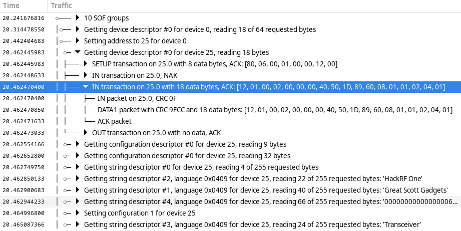

==============
User Interface
==============

Action Bar
----------

Across the top of the Packetry window is the Action Bar used to control Packetry.

.. image:: ../images/action-bar.png
  :alt: Action Bar

- **Open Button**: Loads a ``.pcap`` file with the ``LINKTYPE_USB_2_0`` link-layer header type.
- **Save Button**: Saves a ``.pcap`` file with the ``LINKTYPE_USB_2_0`` link-layer header type.
- **Scan Button**: Searches for a capture device such as a Cynthion running analyzer gateware.
- **Capture Button**: Starts capturing USB data with the connected capture device.
- **Stop Button**: Stops capturing USB data.
- **Device Drop-down**: Selects a capture device. If you don't see a device listed here, try using the Scan button.
- **Speed Drop-down**: Selects the target device speed for live capture.

Traffic Pane
------------

Beneath the Action Bar is the Traffic Pane. This is Packetry's main view of captured USB data.

The Traffic Pane displays packets in an interactive hierarchical view, allowing you to expand high level events to explore their constituent low level transactions and packets.

Each packet is displayed with a precise time stamp relative to the start of capture. Higher level groups have a time stamp matching the first packet that is a part of the group.

Device Pane
-----------

To the right of the Traffic Pane is the Device Pane. The Device Pane summarizes information about observed USB devices on the target bus.

.. image:: ../images/device-pane.png
  :alt: Device Pane

Much of the information that can be displayed in the Device Pane is discovered only if Packetry observes the initial enumeration of a USB device by the target host. To allow this to take place in a live capture, connect the target device after starting a capture, not before.

Status Bar
----------

At the bottom of the Packetry window is the Status Bar.

.. image:: ../images/status-bar.png
  :alt: Status Bar

The Status Bar tells you what Packetry is doing.
