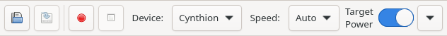
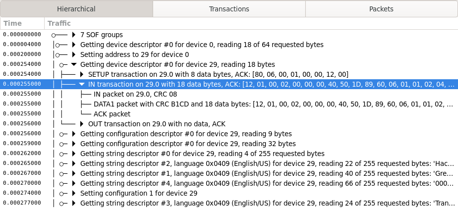
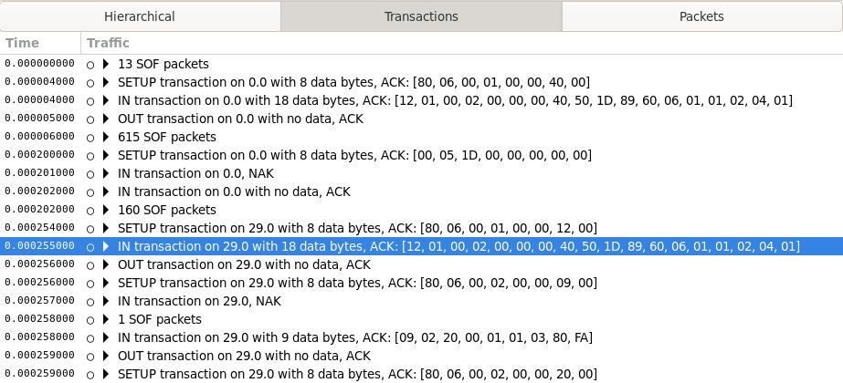
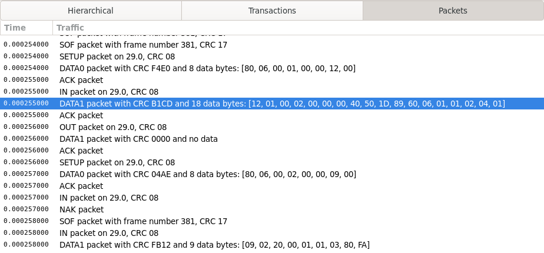
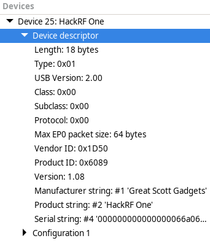
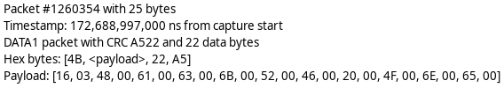

==============
User Interface
==============

Action Bar
----------

Across the top of the Packetry window is the Action Bar used to control Packetry.

- **Open Button**: Clears Traffic Pane and Device Pane and loads a ``.pcap`` file with the ``LINKTYPE_USB_2_0`` link-layer header type.
- **Save Button**: Saves a ``.pcap`` file with the ``LINKTYPE_USB_2_0`` link-layer header type.
- **Scan Button**: Searches for a capture device such as a Cynthion running analyzer gateware.
- **Capture Button**: Clears Traffic Pane and Device Pane and starts capturing USB data with the connected capture device.
- **Stop Button**: Stops capturing USB data. Stops reading USB data from file.
- **Device Drop-down**: Selects a capture device. If you don't see a device listed here, try using the Scan button.
- **Speed Drop-down**: Selects the target device speed for live capture.

Traffic Pane
------------

Beneath the Action Bar is the Traffic Pane. This is Packetry's main view of captured USB data.
At the top of the Traffic Pane there are buttons to switch between different views of the captured data.

Each packet is displayed with a precise time stamp relative to the start of capture.
Higher level groups have a time stamp matching the first packet that is a part of the group.

The Traffic Pane is cleared at the start of each capture or when a file is loaded.

Hierarchical View
^^^^^^^^^^^^^^^^^

This displays an interactive hierarchical view, allowing you to expand high level events to explore their constituent low level transactions and packets.

  .. note::

      Since multiple high level events can be happening at the same time, this view may show packets out of chronological order.
      An interleaved view that still shows packets in order is in progress, tracked here: https://github.com/greatscottgadgets/packetry/pull/150

Transactions View
^^^^^^^^^^^^^^^^^

This combines packets into expandable groups for each USB transaction.
It is more verbose than the hierarchical view, but guarantees that all items are shown in chronological order.

Packets View
^^^^^^^^^^^^

This shows all packets captured on the wire in order, with no grouping.

Device Pane
-----------

To the right of the Traffic Pane is the Device Pane. The Device Pane summarizes information about observed USB devices on the target bus.

Much of the information that can be displayed in the Device Pane is discovered only if Packetry observes the initial enumeration of a USB device by the target host. To allow this to take place in a live capture, connect the target device after starting a capture, not before.

The Device Pane is cleared at the start of each capture or when a file is loaded.

Detail Pane
-----------

The Detail Pane is located below the Traffic Pane. It provides a detailed view of an item selected in the Traffic Pane and allows copying of data from that item.

Depending on the item selected, the Detail Pane may provide different information. For example, when a string descriptor request transfer is selected, the Detail Pane summarizes the request including the actual string as text. By expanding that transfer in the Traffic Pane you can select a transaction or packet within the transfer to view packet data in hexadecimal in the Detail Pane.

Status Bar
----------

At the bottom of the Packetry window is the Status Bar.

The Status Bar tells you what Packetry is doing.
