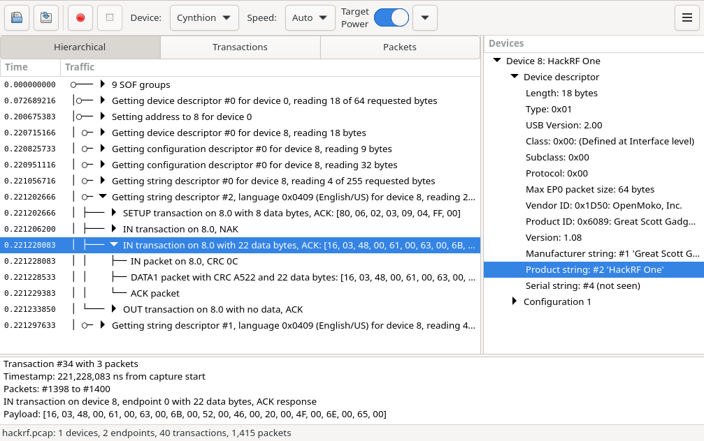

=================
What is Packetry?
=================

Packetry is a fast, intuitive USB 2.0 protocol analysis application for use with `Cynthion <https://greatscottgadgets.com/cynthion/>`__ or for exploring previously captured USB traffic. Designed from the ground up to handle the challenges of USB analysis, Packetry enables live capture and visual representation of physical layer packet data for High Speed (480 Mbps), Full Speed (12 Mbps), and Low Speed (1.5 Mbps) USB.

